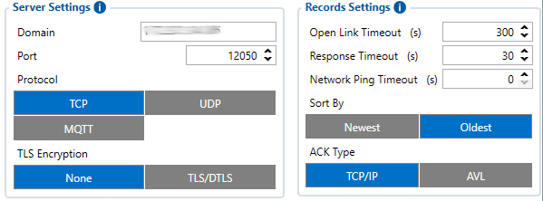
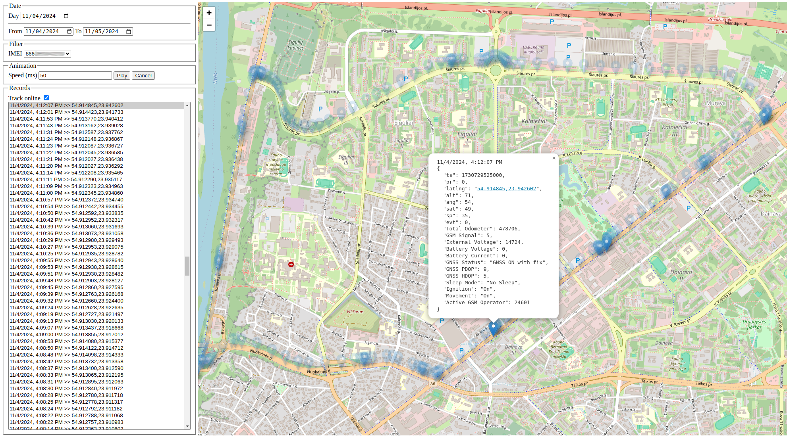

# GPS Server and map for Teltonika trackers

## Tracker configuration

Go to System settings: https://wiki.teltonika-gps.com/view/FMC880_System_settings

- Data protocol
  - Codec JSON (other binary codecs are not supported yet)


Go to GPRS settings: https://wiki.teltonika-gps.com/view/FMC880_GPRS_settings

- Server settings
  - Domain = `<your_ip_or_domain>`
  - Port = `<port>` (12050 by default)
  - Protocol = TCP

- Record settings
  - ACK Type = TCP/IP



## Installation

See [Releases](https://github.com/jackcvr/gpsmap/releases)

## Configuration

Adjust `/etc/gpsmap/gpsmap.toml` config to your needs

Sample config:
```toml
dbfile = "/var/lib/gpsmap/db.sqlite3"  # all the data will be stored here
tz = "Europe/Vilnius"
debug = false

[http]
bind = "0.0.0.0:12000"  # web interface endpoint
certfile = "/root/server.crt"  # crt and key certificate files are mandatory (for TLS)
keyfile = "/root/server.key"
username = "admin"  # basic auth settings
password = "admin" # change it!

[gprs]
bind = "0.0.0.0:12050"  # endpoint of TCP server for receiving GPRS data from tracker
```

After all preparation is done, restart `gpsmap` service and 
your web interface should be available at: `https://<your_ip_or_domain>:<port>/`

## Screenshots



## Useful links
- https://wiki.teltonika-gps.com/view/FMC880_Teltonika_Data_Sending_Parameters_ID